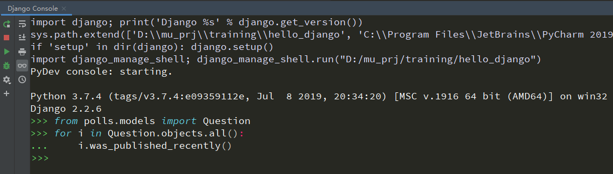

## 创建 project

cmd 运行
```cmd
django-admin startproject mysite
```

将会在当前文件夹在生成
```
mysite/
    manage.py
    mysite/
        __init__.py
        settings.py
        urls.py
        wsgi.py
```

然后运行
```cmd
python manage.py runserver
```

访问 http://127.0.0.1:8000/ ，可看到

> The install worked successfully! Congratulations!

页面

### 如何修改端口
```cmd
python manage.py runserver 8080
```

### 如何修改访问 IP
```cmd
python manage.py runserver 0:8000
```

`0` 是 `0.0.0.0`的缩写。

## 创建 app
app 是提供一个 web 服务
project 是一堆配置的集合
一个 project 里可以有 app
一个 app 可以在多个 project 里

App 可以放在任意的`Python Path` 里。
当然，如果没有必要，我们就都放在 `manage.py` 文件夹的旁边。

执行
```cmd
python manage.py startapp polls
```

会创建
```
polls/
    __init__.py
    admin.py
    apps.py
    migrations/
        __init__.py
    models.py
    tests.py
    views.py
```

## 第一个 url 访问

### 创建 view

在文件 `polls/views.py` 里增加一个 view
```python
from django.http import HttpResponse


def index(request):
    return HttpResponse("Hello, world. You're at the polls index.")
```

### 创建 url

在文件 `polls/urls.py`(如果没有就创建出来), 追加一个 url
```python
from django.urls import path

from . import views

urlpatterns = [
    path('', views.index, name='index'),
]
```

### 将 polls/urls 追加到 project/urls
在文件 `mysite/urls.py` 里
```python
# mysite/urls.py

from django.contrib import admin
from django.urls import path, include


urlpatterns = [
    path('polls/', include('polls.urls')),
    path('admin/', admin.site.urls),
]

```

> 当你想添加 url 映射到 project 里时，一定要用 `include`。 （`admin`除外

好了，你已经成功添加了个 `/polls/` 到网站了。
运行
```cmd
python manage.py runserver
```
访问 http://127.0.0.1:8000/polls/ 
可以看到

> Hello world. You're at the rolls index.


### Django 处理过程


当`runserver`后，执行顺序

`manage`—— 找到`DJANGO_SETTING_MODULE`(`settings` 文件)

`settings` 文件中——找到 `ROOT_URLCONF` （`urls` 文件）

`urls`文件——加载所有的 `urlpatterns`


1. 进来的请求转入`/hello/`
2. `Django`通过在`ROOT_URLCONF`配置来决定根`URLconf`
3. `Django`在`URLconf`中的所有`URL`模式中，查找第一个匹配`/hello/`的条目。
4. 如果找到匹配，将调用相应的视图函数
5. 视图函数返回一个`HttpResponse`
6. `Django`转换`HttpResponse`为一个适合的`HTTP response`， 以`Web page`显示出来

## 设置数据库


> 如果你打算用默认的`SQLite`，这一步啥也不用做，`Django` 已经帮你做好了。


### 数据库准备

在`mysite/settings.py` 文件里的`DATABASES`变量的`default`key，进行数据库的配置。

* **ENGINE** : 可以是`django.db.backends.sqlite3`(默认)，或`django.db.backends.postgresql`，`django.db.backends.mysql`或者`django.db.backends.oracle`等等
* **NAME**：数据库的名字，如果是`SQLite`，这里就写文件的绝对路径。如果是其他数据库，还要配置一下吉祥
* **USER**
* **PASSWORD**
* **HOST**


注意哈，你要现在你的数据库里，把填写的名字的数据库创建出来`CREATE DATABASE database_name` ,这里的名字就是 **NAME** 


这时候，顺便设置一下时区也是极好的: `TIME_ZONE`


此时，数据库里还没有`table`啥的，我们需要把这些表创建出来

执行

```
python manage.py migrate
```

`Django`会给你创建出一些`Django`本身就必须得表。


### 创建 Model

在 `polls/models.py` 里进行 数据` model `的定义

单独弄一个model 也可，但必须叫 `models/`

```python
# polls/model.py
# or 
# polls/models/__init__.py

from django.db import models


class Question(models.Model):
    question_text = models.CharField(max_length=200)
    pub_date = models.DateTimeField('date published')


class Choice(models.Model):
    question = models.ForeignKey(Question, on_delete=models.CASCADE)
    choice_text = models.CharField(max_length=200)
    votes = models.IntegerField(default=0)
```

`Django` 要做的事：

1. 在数据库中创建出这些表(**CREATE** **TABLE** xxx)
2. 创建 python api 来以面向对象方式访问这些表

### 激活 Model

`Django` app 都是以插件显示存在的，哪个 project 要用这个 app，就把 app 配置到 project里，不用了，就注释掉。

而且我们的`polls` app，在`polls/apps.py` 里面有个`PollsConfig` 的类，将其追加到 `mysite/settings.py` 的 `INSTALLED_APPS`里，如下所示

```python
# mysite/settings.py

INSTALLED_APPS = [
    'polls.apps.PollsConfig',
    'django.contrib.admin', 
    # ...
]
```

现在`Django` 就认到了`polls` app，接下来执行

```cmd
python manage.py makemigrations polls
```

将会得到以下信息

```she
Migrations for 'polls':
  polls\migrations\0001_initial.py
    - Create model Question
    - Create model Choice
```


因为我们改了数据库表的信息（增加了俩表），执行下面的命令，将修改的表更新并创建出来

```
python manage.py migrate
```


之后我们就可以在 `Django` 环境下玩耍了

执行

```python manage.py shell```

使用 `PyCharm`的话，可以直接在`Python Console`里（要是 `setting` 里开启 `Django` 支持）




### 创建管理员

执行

```shell
python manage.py createsuperuser
```

根据提示，输入用户名和密码。

开启服务后，我们就可以在浏览器上访问`127.0.0.1:8000/admin`后台数据了。

```
python manage.py runserver
```

